# IND Money Weekly Review Pulse -- Detailed Architecture

## 1. Problem Statement

**Product:** IND Money (Play Store app `in.indwealth`)

Turn recent Play Store reviews (last 8-12 weeks) into a **one-page weekly pulse** containing:

- Top 3-5 themes (discovered and grouped by LLM)
- 3 real user quotes (verbatim, PII-free)
- 3 concrete action ideas for the product team

Finally, send a draft email containing the weekly note via SMTP.

**Hard constraint:** No Personally Identifiable Information (PII) in any output.

### Who This Helps

| Audience | Value |
|---|---|
| Product / Growth Teams | Understand what to fix next |
| Support Teams | Know what users are saying and acknowledging |
| Leadership | Quick weekly health pulse |

---

## 2. High-Level Architecture

The **Streamlit dashboard is the sole entry point**. There is no CLI -- all operations (scraping, analysis, report preview, email dispatch) are triggered interactively from the UI.

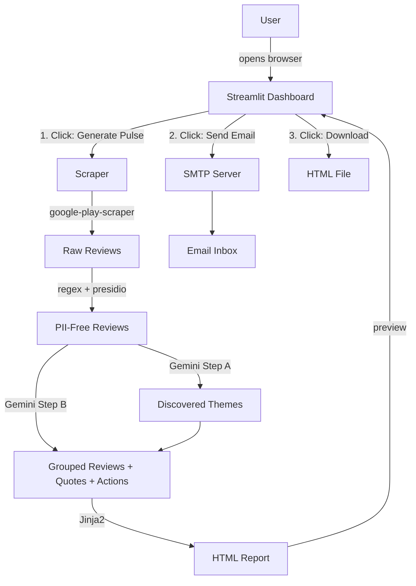

---

## 3. Project Structure

```
IND-Money-Review-Analyser/
├── app.py                          # Streamlit entry point (Phase 6)
├── config.py                       # Centralized settings and env var loading
├── requirements.txt                # Python dependencies
├── .env.example                    # Template for required environment variables
├── README.md                       # Setup and usage guide
├── ARCHITECTURE.md                 # This file
├── src/
│   ├── __init__.py
│   ├── phase1_scraper/
│   │   ├── __init__.py
│   │   └── scraper.py              # Play Store review fetcher
│   ├── phase2_pii/
│   │   ├── __init__.py
│   │   └── pii_scrubber.py         # PII detection and redaction
│   ├── phase3_analyzer/
│   │   ├── __init__.py
│   │   └── analyzer.py             # Gemini LLM two-step analysis
│   ├── phase4_report/
│   │   ├── __init__.py
│   │   └── report_generator.py     # Jinja2 HTML report builder
│   └── phase5_email/
│       ├── __init__.py
│       └── email_sender.py         # SMTP email dispatcher
└── templates/
    └── weekly_pulse.html           # Jinja2 template for the one-page report
```

---

## 4. Phase-by-Phase Detailed Design

### Phase 1: Play Store Review Scraping

**File:** `src/phase1_scraper/scraper.py`
**Dependency:** `google-play-scraper`, `langdetect`

#### Responsibilities

- Fetch reviews for app ID `in.indwealth` from the Google Play Store.
- Pull reviews from the **last 8-12 weeks** (configurable).
- Sort by newest first; paginate through batches until the date cutoff is reached.
- Normalize each review into a standard dict.

#### Data Model

```python
ReviewRecord = {
    "review_text": str,       # Full review body
    "title": str,             # Review title (may be empty)
    "rating": int,            # 1-5 star rating
    "date": datetime,         # Review submission date
    "thumbs_up_count": int,   # Helpfulness votes
}
```

#### Key Function

```python
def fetch_recent_reviews(app_id: str = "in.indwealth", weeks: int = 10) -> list[dict]:
    """
    Fetches Play Store reviews from the last `weeks` weeks.
    Returns a list of ReviewRecord dicts sorted by date descending.
    """
```

#### Flow

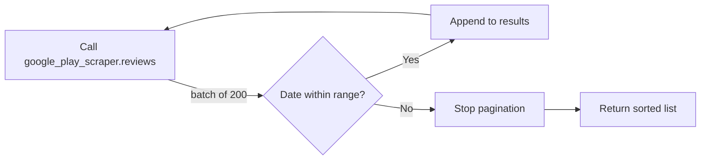

#### Design Decisions

- The `google-play-scraper` library fetches public data -- no API key required.
- Pagination uses continuation tokens; we stop when reviews fall outside the date window.
- Reviews with empty text are discarded.

---

### Phase 2: PII Scrubbing

**File:** `src/phase2_pii/pii_scrubber.py`
**Dependencies:** `presidio-analyzer`, `presidio-anonymizer`, `re` (stdlib)

#### Responsibilities

- Detect and redact all PII from review text **before** it reaches the LLM or any output.
- Handle India-specific PII patterns that generic NER models miss.

#### PII Categories and Detection Methods

| PII Type | Detection Method | Replacement Token |
|---|---|---|
| Email addresses | Regex `[\w.-]+@[\w.-]+\.\w+` | `[REDACTED_EMAIL]` |
| Phone numbers | Regex for Indian formats: `+91`, `0xx-xxxxxxx`, 10-digit | `[REDACTED_PHONE]` |
| Aadhaar numbers | Regex `\d{4}[\s-]?\d{4}[\s-]?\d{4}` | `[REDACTED_AADHAAR]` |
| PAN card | Regex `[A-Z]{5}\d{4}[A-Z]` | `[REDACTED_PAN]` |
| UPI IDs | Regex `[\w.-]+@[a-z]{2,}` (after email removal) | `[REDACTED_UPI]` |
| Person names | Presidio NER (PERSON entity) | `[REDACTED_NAME]` |

#### Key Function

```python
def scrub_pii(text: str) -> str:
    """
    Removes all PII from the input text.
    Returns sanitized text with redaction tokens.
    """
```

#### Processing Order

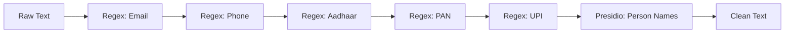

Regex runs first so that email/UPI patterns are not confused with names by the NER model.

#### Design Decisions

- **Presidio over raw spaCy:** Microsoft Presidio wraps spaCy NER with better entity recognition tuning and a clean anonymization API, avoiding the need to load and manage spaCy models separately.
- **Regex first:** Deterministic patterns (emails, phones) are caught before statistical NER, reducing false negatives.

---

### Phase 3: Gemini LLM Analysis

**File:** `src/phase3_analyzer/analyzer.py`
**Dependency:** `google-generativeai`

#### Responsibilities

- Discover recurring themes from the review corpus.
- Group reviews under themes, extract representative quotes, and generate action ideas.
- All via **Gemini 2.5 Flash** with structured JSON output.
- Gemini's 1M-token context window allows sending all reviews in a single call -- no batching needed.

#### Two-Step Prompting Strategy

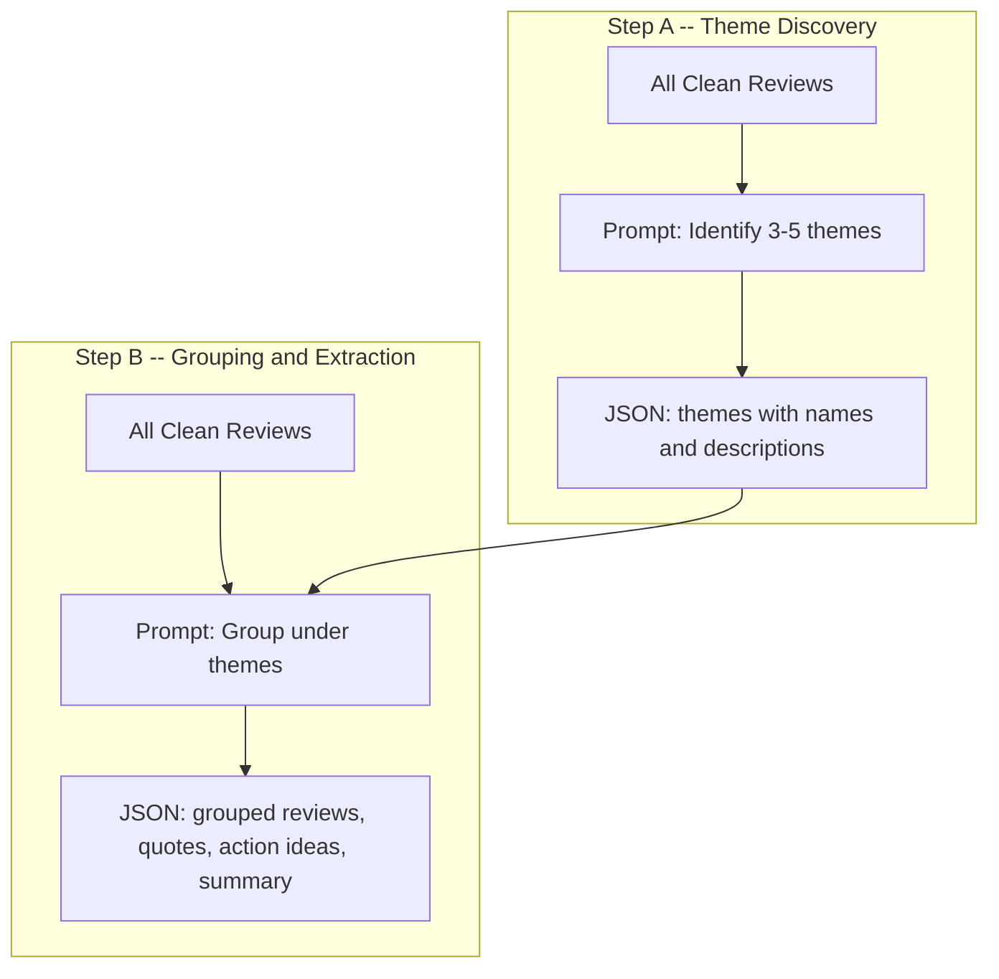

##### Step A -- Theme Discovery

**Prompt structure:**

```
You are a product analyst. Given the following user reviews for the IND Money app,
identify the top 3-5 recurring themes. For each theme provide:
- theme_name: a short descriptive label
- description: one-sentence explanation
- sentiment: "positive", "negative", or "mixed"
- estimated_count: approximate number of reviews about this theme

Return valid JSON only.
```

**Expected output schema:**

```json
{
  "themes": [
    {
      "theme_name": "App Crashes on Login",
      "description": "Users report the app crashing or freezing during the login flow.",
      "sentiment": "negative",
      "estimated_count": 45
    }
  ]
}
```

##### Step B -- Grouping + Extraction

**Prompt structure:**

```
You are a product analyst. Given these user reviews and the following discovered themes,
perform these tasks:
1. Assign each review to the most relevant theme.
2. Select exactly 3 representative user quotes (verbatim from reviews).
3. Generate exactly 3 actionable product improvement ideas.
4. Write a 2-3 sentence executive summary.

Return valid JSON only.
```

**Expected output schema:**

```json
{
  "theme_groups": [
    {
      "theme_name": "App Crashes on Login",
      "review_count": 42,
      "sentiment": "negative",
      "sample_reviews": ["review text 1", "review text 2"]
    }
  ],
  "top_quotes": [
    { "quote": "Exact user quote here", "rating": 2, "theme": "App Crashes on Login" }
  ],
  "action_ideas": [
    {
      "title": "Stabilize Login Flow",
      "description": "Investigate and fix crash on login for Android 12+ devices.",
      "priority": "high",
      "related_theme": "App Crashes on Login"
    }
  ],
  "summary": "This week, IND Money reviews were dominated by..."
}
```

#### Key Function

```python
def analyze_reviews(reviews: list[dict]) -> dict:
    """
    Two-step Gemini analysis: discover themes, then group and extract.
    Returns combined analysis dict with themes, quotes, actions, summary.
    """
```

#### Design Decisions

- **Two-step over single prompt:** Separating theme discovery from grouping gives the LLM focused context in each call, producing more accurate themes and better-grouped results.
- **`response_mime_type="application/json"`:** Forces Gemini to return parseable JSON, eliminating fragile regex parsing of LLM output.
- **No batching needed:** Gemini 2.0 Flash has a 1M-token context window, so all reviews are sent in a single call per step, producing more coherent themes and better-grouped results.

---

### Phase 4: Report Generation

**File:** `src/phase4_report/report_generator.py`
**Template:** `templates/weekly_pulse.html`
**Dependency:** `jinja2`

#### Responsibilities

- Render the analysis JSON into a clean, professional, single-page HTML report.
- Also produce a plain-text version for email fallback.

#### HTML Report Sections

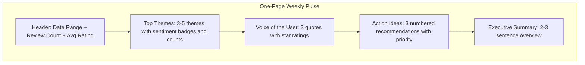

#### Template Design

The Jinja2 template (`templates/weekly_pulse.html`) will use:
- Inline CSS for email compatibility (no external stylesheets).
- A clean, card-based layout with IND Money brand colors.
- Sentiment badges: green for positive, red for negative, amber for mixed.
- Star rating display using Unicode characters.
- Responsive design that works in email clients and browser preview.

#### Key Function

```python
def generate_report(analysis: dict, metadata: dict) -> tuple[str, str]:
    """
    Renders the weekly pulse report.
    Args:
        analysis: Output from analyzer.py
        metadata: { date_range, total_reviews, avg_rating }
    Returns:
        (html_content, plain_text_content)
    """
```

---

### Phase 5: SMTP Email Dispatch

**File:** `src/phase5_email/email_sender.py`
**Dependencies:** `smtplib`, `email.mime` (both stdlib)

#### Responsibilities

- Send the weekly pulse as a multipart email (HTML + plain text fallback).
- Recipient email addresses are provided at runtime by the Streamlit frontend (Phase 6), not from `.env`.

#### Email Structure

```
From: {SMTP_USER}
To: {recipients from UI}
Subject: IND Money Weekly Pulse -- Week of {start_date} to {end_date}
Content-Type: multipart/alternative
  ├── text/plain  (plain text report)
  └── text/html   (HTML report)
```

#### Key Function

```python
def send_pulse_email(
    html_content: str,
    text_content: str,
    recipients: list[str],
    date_range: str
) -> bool:
    """
    Sends the weekly pulse email via SMTP.
    Returns True on success, raises on failure.
    """
```

#### Configuration

SMTP server settings come from environment variables. Recipients are entered in the Streamlit UI.

| Variable | Source | Example | Description |
|---|---|---|---|
| `SMTP_HOST` | `.env` | `smtp.gmail.com` | SMTP server hostname |
| `SMTP_PORT` | `.env` | `587` | SMTP port (TLS) |
| `SMTP_USER` | `.env` | `you@gmail.com` | Sender email address |
| `SMTP_PASSWORD` | `.env` | `app-password` | SMTP password or app password |
| `recipients` | **Streamlit UI** | `team@company.com` | Entered by user in the frontend |

---

### Phase 6: CLI + Web Application (FastAPI + Next.js)

Phase 6 provides two ways to interact with the pipeline: a **CLI** for terminal usage and a **Web UI** built with a FastAPI backend and Next.js frontend.

#### 6A. CLI (`cli.py`)

**File:** `cli.py`

A command-line interface using `argparse` for running individual phases or the full pipeline from the terminal.

```bash
python3.11 cli.py scrape --weeks 12        # Phase 1 only
python3.11 cli.py analyze                   # Phases 1-3
python3.11 cli.py report --name Harika      # Phases 1-4
python3.11 cli.py email --name Harika --email user@example.com  # Phase 5
python3.11 cli.py run --name Harika --email user@example.com    # Full pipeline
```

Each sub-command automatically runs prerequisite phases if their output files are missing.

#### 6B. Web Application (FastAPI + Next.js)

**Backend:** `api.py` -- FastAPI REST API
**Frontend:** `frontend/` -- Next.js (TypeScript + Tailwind CSS)
**Dependencies:** `fastapi`, `uvicorn[standard]`, `next`, `react`, `tailwindcss`

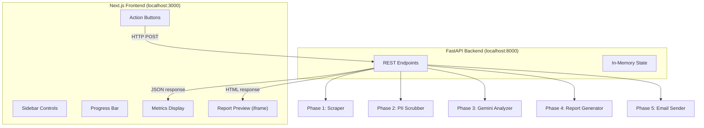

#### API Endpoints

| Method | Endpoint | Description |
|---|---|---|
| `GET` | `/api/health` | Health check |
| `POST` | `/api/scrape` | Phase 1: Scrape reviews (accepts `weeks`) |
| `POST` | `/api/scrub` | Phase 2: Scrub PII |
| `POST` | `/api/analyze` | Phase 3: LLM analysis |
| `POST` | `/api/report` | Phase 4: Generate report (accepts `recipient_name`) |
| `GET` | `/api/report/preview` | Returns generated HTML report |
| `POST` | `/api/email` | Phase 5: Send email (accepts `recipient_name`, `recipient_email`) |
| `POST` | `/api/run` | Run full pipeline in one call |
| `GET` | `/api/state` | Current pipeline state |

#### Frontend UI Layout

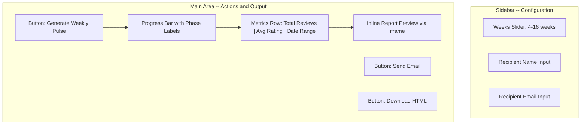

#### Interaction Flow

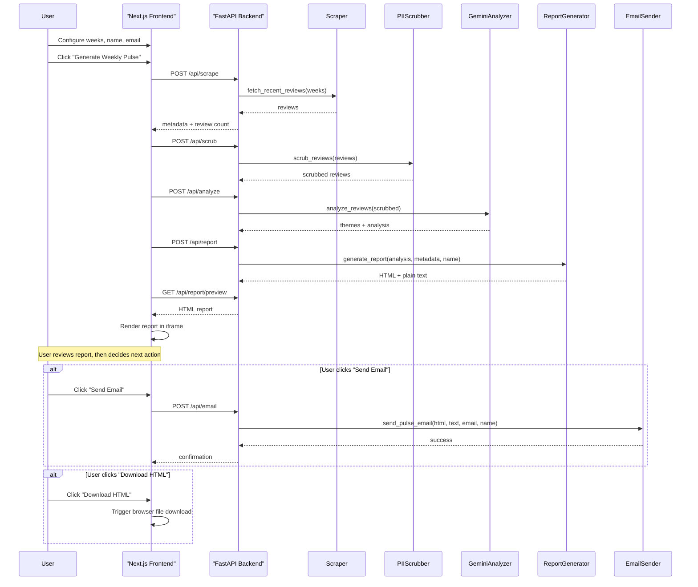

#### Running the Web Application

```bash
# Terminal 1: Start the FastAPI backend
uvicorn api:app --reload --port 8000

# Terminal 2: Start the Next.js frontend
cd frontend && npm run dev
```

The frontend runs at `http://localhost:3000` and calls the backend at `http://localhost:8000`.

#### State Management

- The FastAPI backend keeps pipeline results in an in-memory dict (`_state`).
- State includes: `reviews`, `scrubbed`, `analysis`, `metadata`, `html_report`, `text_report`.
- State resets when the server restarts.
- The "Send Email" and "Download" buttons are disabled until a report has been generated.

---

## 5. Configuration Layer

**File:** `config.py`

```python
# Loads .env and exposes all settings as module-level constants
APP_ID = "in.indwealth"
DEFAULT_WEEKS = 10
GEMINI_MODEL = "gemini-2.5-flash"
```

**File:** `.env.example`

```env
GEMINI_API_KEY=your-gemini-api-key-here
SMTP_HOST=smtp.gmail.com
SMTP_PORT=587
SMTP_USER=your-email@gmail.com
SMTP_PASSWORD=your-app-password
EMAIL_RECIPIENTS=recipient@example.com
```

---

## 6. Dependency Map

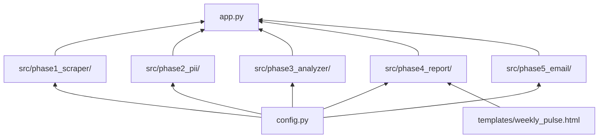

---

## 7. Key Dependencies

| Package | Version | Purpose |
|---|---|---|
| `google-play-scraper` | latest | Scrape Play Store reviews |
| `langdetect` | latest | Filter non-English reviews |
| `google-generativeai` | latest | Gemini API SDK |
| `presidio-analyzer` | latest | PII entity detection |
| `presidio-anonymizer` | latest | PII redaction |
| `jinja2` | latest | HTML report templating |
| `fastapi` | latest | REST API backend |
| `uvicorn[standard]` | latest | ASGI server for FastAPI |
| `next` (npm) | latest | React frontend framework |
| `tailwindcss` (npm) | latest | Utility-first CSS |
| `apscheduler` | latest | Weekly cron scheduler |
| `python-dotenv` | latest | Load `.env` files |

---

## 8. Security Considerations

- **PII is scrubbed before LLM calls** -- no personal data leaves the local environment except in redacted form.
- **API keys are never hardcoded** -- all secrets live in `.env` (git-ignored).
- **SMTP password** should be an app-specific password, not the primary account password.
- **No review data is persisted to disk** -- everything is in-memory per session.

---

## 9. Implementation Order

| Order | Phase | File(s) | Depends On |
|---|---|---|---|
| 1 | Scraper | `config.py`, `src/phase1_scraper/`, `requirements.txt`, `.env.example` | Nothing |
| 2 | PII Scrubber | `src/phase2_pii/` | Phase 1 (reviews to scrub) |
| 3 | LLM Analyzer | `src/phase3_analyzer/` | Phase 2 (clean reviews) |
| 4 | Report Gen | `src/phase4_report/`, `templates/weekly_pulse.html` | Phase 3 (analysis JSON) |
| 5 | Email Sender | `src/phase5_email/` | Phase 4 (HTML report) |
| 6 | CLI + Web App | `cli.py`, `api.py`, `frontend/` | All phases -- CLI, FastAPI backend, Next.js frontend |
| 7 | Scheduler | `scheduler.py` | All phases -- runs the pipeline on a weekly cron |

Each phase is independently testable. Phase N produces output that Phase N+1 consumes.

The pipeline can be triggered in four ways:
1. **CLI (Phase 6A)** -- command-line interface for terminal-based pipeline runs.
2. **Web UI (Phase 6B)** -- Next.js frontend + FastAPI backend for interactive browser-based runs.
3. **Local Scheduler (Phase 7)** -- APScheduler-based weekly cron running on a local machine.
4. **GitHub Actions (Phase 7)** -- cloud-based weekly cron via `.github/workflows/weekly-pulse.yml`, with manual trigger support.

---

### Phase 7: Weekly Scheduler

**File:** `scheduler.py`
**Dependency:** `apscheduler`

#### Responsibilities

- Run the full pipeline (Phase 1 through Phase 5) automatically every week at a fixed time.
- Uses the **CLI** (`cli.py run`) under the hood via `subprocess.run`, reusing the same pipeline logic.
- Provide a `--now` flag for immediate one-off runs without waiting for the scheduled time.
- Log each pipeline run with timing information.

#### How It Works

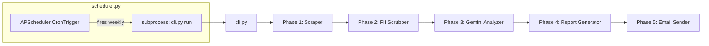

#### Default Schedule

- **When:** Every Monday at **3:35 PM IST** (Asia/Kolkata timezone)
- **Fixed recipient:** `harikateja116@gmail.com`

#### Configuration

All settings come from `.env`:

| Variable | Default | Description |
|---|---|---|
| `SCHEDULE_DAY` | `mon` | Day of the week (`mon`, `tue`, `wed`, etc.) |
| `SCHEDULE_HOUR` | `15` | Hour in 24h format, IST (0-23) |
| `SCHEDULE_MINUTE` | `35` | Minute (0-59) |
| `RECIPIENT_NAME` | `Team` | Recipient name for the personalised greeting |
| `RECIPIENT_EMAIL` | `harikateja116@gmail.com` | Fixed recipient email address |

#### Usage

```bash
# Start the scheduler (runs in foreground, fires every Monday at 3:35 PM IST)
python3.11 scheduler.py

# Run the pipeline immediately, then exit
python3.11 scheduler.py --now
```

#### Design Decisions

- **CLI-based execution:** The scheduler invokes `cli.py run` via `subprocess.run` rather than calling pipeline functions directly. This reuses the same tested CLI logic and keeps the scheduler thin.
- **IST timezone:** The `BlockingScheduler` and `CronTrigger` are configured with `timezone="Asia/Kolkata"` so the schedule fires at the correct local time.
- **APScheduler with BlockingScheduler:** Lightweight, single-process scheduler that keeps running in the foreground. No external services (Redis, RabbitMQ) needed.
- **CronTrigger:** Uses cron-style scheduling for precise weekly firing. `misfire_grace_time=3600` ensures the job still runs if the machine was briefly asleep.
- **Graceful shutdown:** Handles SIGINT/SIGTERM so Ctrl+C cleanly stops the scheduler.
- **`--now` flag:** Allows quick testing or ad-hoc runs without waiting for the next scheduled time.

#### GitHub Actions Integration

**File:** `.github/workflows/weekly-pulse.yml`

The scheduler is also available as a **GitHub Actions workflow** so the pipeline runs automatically in the cloud without keeping a local machine on.

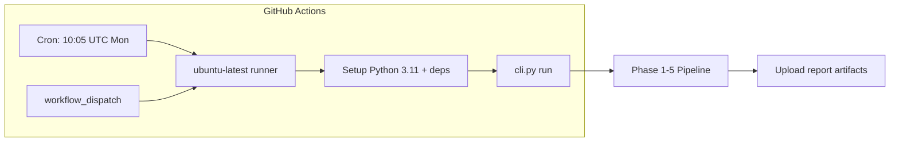

**Schedule:** Every Monday at `10:05 UTC` (3:35 PM IST) -- same as the local scheduler.

**Manual trigger:** Can also be run on-demand from the GitHub Actions UI via `workflow_dispatch`.

**Secrets required** (configure in GitHub repo Settings > Secrets and variables > Actions):

| Secret | Description |
|---|---|
| `GEMINI_API_KEY` | Gemini API key |
| `SMTP_HOST` | SMTP server (e.g. `smtp.gmail.com`) |
| `SMTP_PORT` | SMTP port (e.g. `587`) |
| `SMTP_USER` | Sender email address |
| `SMTP_PASSWORD` | Gmail app password |
| `RECIPIENT_NAME` | Recipient name for greeting |
| `RECIPIENT_EMAIL` | Fixed recipient email (`harikateja116@gmail.com`) |

**Artifacts:** After each run, the workflow uploads `weekly_pulse.html`, `weekly_pulse.txt`, and `analysis_output.json` as downloadable artifacts (retained for 30 days).
